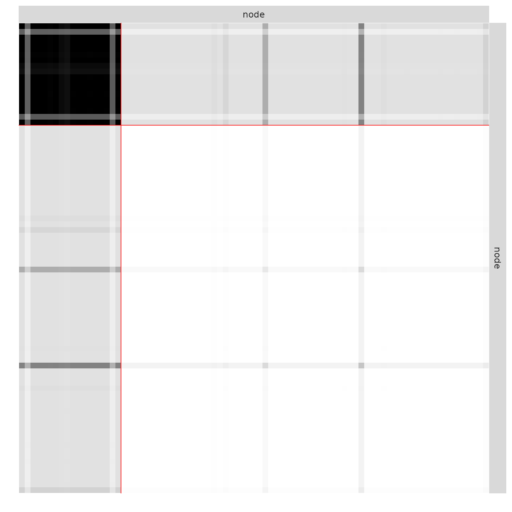
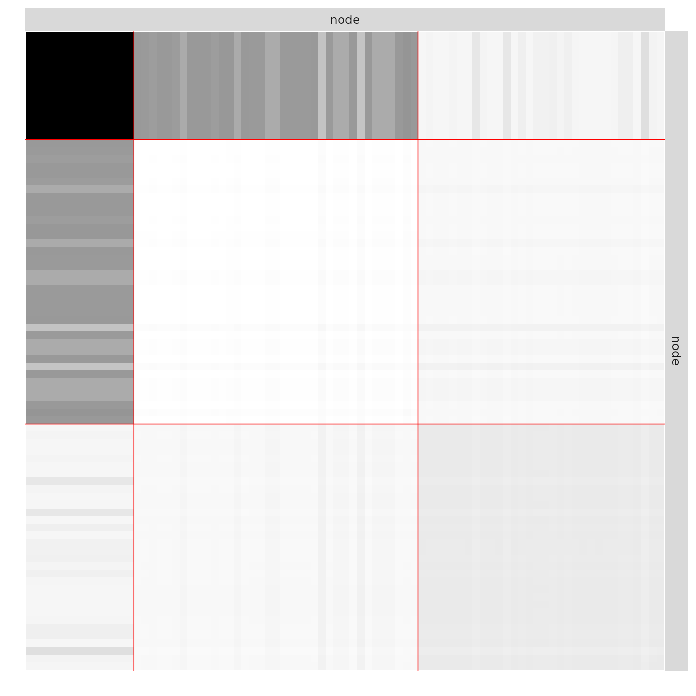
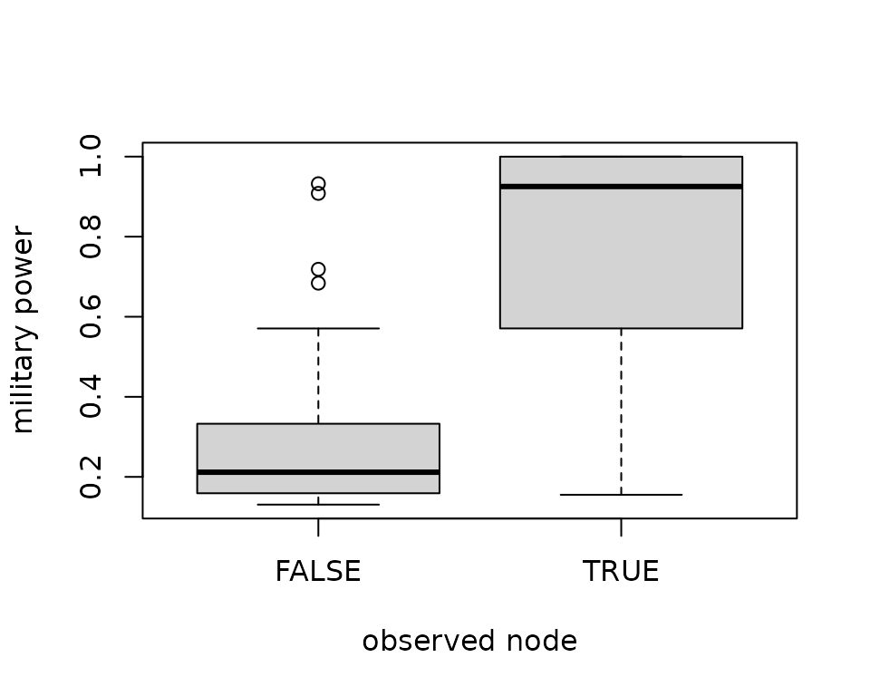
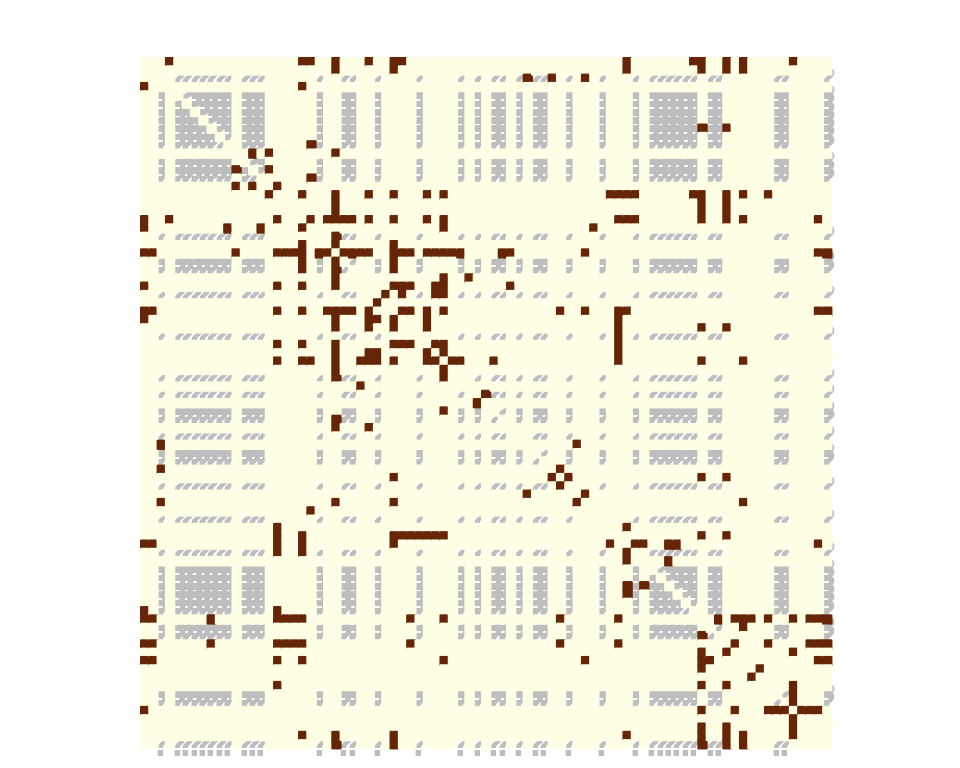
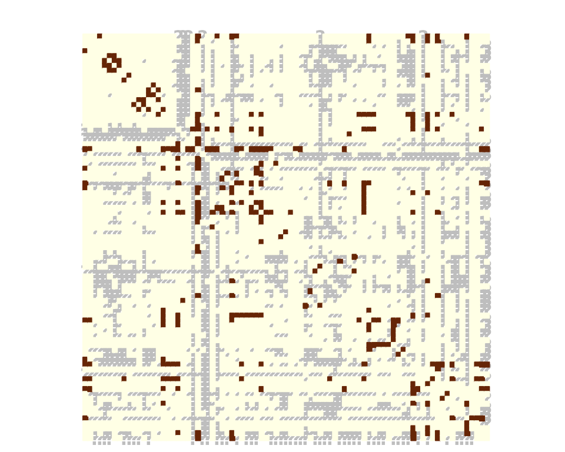

# missSBM: a case study with war networks

## Prerequisites

On top of **missSBM**, our analysis will rely on the **igraph** package
for network data manipulation, and **ggplot2** and **magrittr** for
representation.

``` r

library(igraph)
library(ggplot2)
library(corrplot)
library(magrittr)
library(missSBM)
library(future)
```

**missSBM** integrates some features of the **future** package to
perform parallel computing: you can set your plan now to speed the fit
by relying on 2 workers as follows:

``` r

future::plan("multisession", workers = 2)
```

## The war network

The `war` data set comes with the `missSBM` package:

``` r

data("war")
```

This data set contains a list of two networks (`belligerent` and
`alliance`) where the nodes are countries; an edge in the network
`belligerent` means that the two countries have been at war at least
once between years 1816 to 2007; an edge in network `alliance` means
that the two countries have had a formal alliance between years 1816 and
2012. The network `belligerent` has fewer nodes since countries which
have not been at war at all are not considered.

These two networks were extracted from <https://correlatesofwar.org/>
(see Sarkees and Wayman ([2010](#ref-sarkees2010resort)) for war data,
and Gibler ([2008](#ref-gibler2008international)) for formal alliance).
Version 4.0 was used for war data and version 4.1 for formal alliance.
On top of the two networks, two covariates were considered. One
covariate is concerned with military power of the states (see Singer et
al. ([1972](#ref-singer1972capability)), version 5.0 was used) and the
other is concerned with trade exchanges between countries (see Barbieri
et al. ([2016](#ref-barbieri2012correlates)) and Barbieri et al.
([2009](#ref-barbieri2009trading)), version 4.0 was used). In the
following, we focus on the network `war$belligerent`, which is provided
as an igraph object:

``` r

par(mar = c(0,0,0,0))
plot(war$belligerent,
     vertex.shape="none", vertex.label=V(war$belligerent)$name,
     vertex.label.color = "steel blue", vertex.label.font=1.5,
     vertex.label.cex=.6, edge.color="gray70", edge.width = 2)
```


To pursue our analysis, we extract the adjacency matrix of the network,
a covariate on the vertices describing the military power of each
country, and a covariate on the dyads describing the intensity of trade
between two countries.

``` r

belligerent_adjacency <- as_adjacency_matrix(war$belligerent, sparse = FALSE)
belligerent_power     <- war$belligerent$power
belligerent_trade     <- war$belligerent$trade
```

### Generating missing data

Even though the dataset was complete, we can assume that some data may
be missing for the sake of illustration. More specifically, the data
collection may be missing for some countries in the sense that data were
collected comprehensively for a subset of countries and for the other
countries we only observe their edges with the first subset and not
within them. Thus, the sampling is node-centered and collects edges
information accordingly (there will be a block of missing data on the
diagonal of the adjacency matrix). To this end we rely on the function
`observeNetwork` in **missSBM**:

``` r

partlyObservedNet_war <- observeNetwork(belligerent_adjacency, sampling = "node", parameters = .8)
corrplot(partlyObservedNet_war,
  is.corr      = FALSE,
  tl.pos       = "n",
  method       = "color",
  cl.pos       = "n",
  na.label.col = "grey",
  mar          = c(0,0,1,0)
  )
```


### Estimation with missing data

We can now adjust a Stochastic Block Model with the function
`estimateMissSBM` under this type of sampling: by default, we use a
forward/backward (split and merge) strategy on the clustering to avoid
local minima and get a robust Integrated Classification Likelihood
Criterion, commonly used to perform model selection. This will make the
choice of the number of groups/blocks more robust. The number of
exploration passes can be tuned via the `iterates` argument of
[`missSBM_param()`](https://grosssbm.github.io/missSBM/reference/missSBM_param.md),
passed as the `control` argument (`iterates = 0` disables exploration
entirely).

``` r

vBlocks <- 1:5
collection_sbm <- estimateMissSBM(partlyObservedNet_war, vBlocks, sampling = "node")
```

### Estimation on fully observed network

We would like to compare our results with the clustering obtained on the
fully observed network. To this end, we adjust a collection of SBM on
the original adjacency matrix:

``` r

collection_sbm_full <-
  estimateMissSBM(belligerent_adjacency, vBlocks, sampling = "node", control = missSBM_param(iterates = 2))
```

As expected, the ICL on the fully observed network is better. But more
interestingly, the number of groups selected may differ in the presence
of missing data.

``` r

rbind(
  data.frame(ICL = collection_sbm_full$ICL, nbBlocks = vBlocks, type = "full"),
  data.frame(ICL = collection_sbm$ICL, nbBlocks = vBlocks, type = "missing")
) %>%
  ggplot(aes(x = nbBlocks, y = ICL, group = type, color = type)) +
  labs(title = "Model selection", x = "#blocks", y = "Integrated Classification Likelihood") +
  geom_line() + theme_bw()
```


Indeed, two classes found on the fully observed network fuse in the SBM
fitted on the partially observed network.

``` r

table(
  collection_sbm$bestModel$fittedSBM$memberships,
  collection_sbm_full$bestModel$fittedSBM$memberships
  )
```

    ##    
    ##      1  2  3
    ##   1 14  4  0
    ##   2  0 33 32

The model finally fitted on the network data can be represented thanks
to a plot method applying on objects with class `SBM`:

``` r

par(mfrow = c(1,2))
plot(collection_sbm$bestModel, type = "expected")
```



``` r

plot(collection_sbm_full$bestModel, type = "expected")
```



### Taking covariates into account

This part shows how to account for covariates in the model.

#### Military power

We first consider a covariate reflecting the military power of the
country, hence associated to the nodes. We typically expect a part of
the network to be explained by this covariate. We run the inference on
the fully observed network:

``` r

vBlocks <- 1:3
collection_sbm_power_full <- estimateMissSBM(belligerent_adjacency, vBlocks = vBlocks, sampling = "node", covariates = list(belligerent_power))
```

Note that by default, the distribution of edges depends on the
covariate(s), if any are included in the model.

The covariate provided as a vector is transferred on edges through an
$`\ell_1`$ similarity: for edge $`(i,j)`$ the associated covariate is
defined by $`|x_i-x_j|`$ where $`x_i`$ denotes the covariate for node
$`i`$. Another similarity measure could be provided via the option
`similarity`.

The estimated effect of the covariate is obtained through

``` r

collection_sbm_power_full$bestModel$fittedSBM$covarParam
```

    ## [1] -12.23216

The covariate could be responsible for the sampling. States with bigger
military power are more likely to be fully observed than the others. We
will simulate this sampling. An intercept is considered by default in
the sampling model.

``` r

nWar <- nrow(belligerent_adjacency)
parameters_sample <- 600
sampleNet_power_miss <- observeNetwork(
   belligerent_adjacency,
   sampling = "covar-node",
   parameters = parameters_sample, covariates = list(belligerent_power), intercept = -2
  )
observedNodes <- !is.na(rowSums(sampleNet_power_miss))
boxplot(1/(1 + exp(-cbind(1,belligerent_power) %*% c(-2, parameters_sample))) ~ observedNodes, ylab = "military power", xlab = "observed node")
```



``` r

corrplot(sampleNet_power_miss,
  is.corr      = FALSE,
  tl.pos       = "n",
  method       = "color",
  cl.pos       = "n",
  na.label.col = "grey",
  mar          = c(0,0,1,0)
  )
```



Then, we can estimate the model by setting the sampling to be
`covar-node`. We can still choose whether or not to consider the
covariate in the SBM.

``` r

collection_sbm_power_miss <- estimateMissSBM(sampleNet_power_miss, vBlocks = vBlocks, sampling = "covar-node", covariates = list(belligerent_power))
```

Then we can access the estimated sampling parameters:

``` r

collection_sbm_power_miss$bestModel$fittedSampling$parameters
```

    ## [1]  -1.858769 541.916733

and the parameters in the SBM associated with the covariate:

``` r

collection_sbm_power_miss$bestModel$fittedSBM$covarParam
```

    ## [1] -5.487374

#### Trade data

Another covariate is the average trade exchange between the states. This
covariate is related to pairs of states hence to the dyads. We first
build a matrix of dissimilarity according to this covariate:

``` r

trade <- belligerent_trade
trade[is.na(trade)] <- 0
trade <- trade + t(trade)
trade <- log(trade + 1)
diag(trade) <- 0
```

We then conduct a similar analysis as with the power to see how it can
be accounted for in the SBM.

We first sample according to it:

``` r

parameters_sample <- 1
sampleNet_trade_miss <- observeNetwork(belligerent_adjacency, sampling = "covar-dyad", parameters = parameters_sample, covariates = list(trade), intercept = -2)
corrplot(sampleNet_trade_miss,
  is.corr      = FALSE,
  tl.pos       = "n",
  method       = "color",
  cl.pos       = "n",
  na.label.col = "grey",
  mar          = c(0,0,1,0)
  )
```



The choice of the sampling parameters makes dyads with a large trade
exchange more likely to be observed. We then perform estimation on the
missing data drawn according to the trade covariate.

``` r

collection_sbm_trade_miss <- estimateMissSBM(sampleNet_trade_miss, vBlocks = vBlocks, sampling = "covar-dyad", covariates = list(trade))
```

    ## 
    ## 
    ##  Adjusting Variational EM for Stochastic Block Model
    ## 
    ##  Imputation assumes a 'covar-dyad' network-sampling process
    ## 
    ##  Initialization of 3 model(s). 
    ##  Performing VEM inference
    ##      Model with 2 blocks.    Model with 3 blocks.    Model with 1 blocks. Polishing (node-swap)
    ## 
    ##  Looking for better solutions
    ##  Pass 1   Going forward ++                                                                                                     Pass 1   Going backward ++                                                                                                    

``` r

collection_sbm_trade_miss$bestModel$fittedSampling$parameters
```

    ## [1] -2.205657  1.053432

``` r

collection_sbm_trade_miss$bestModel$fittedSBM$covarParam
```

    ## [1] 0.2038448

When you are done, do not forget to get back to the standard sequential
plan with future.

``` r

future::plan("sequential")
```

## References

Barbieri, Katherine, Omar MG Keshk, and Brian M Pollins. 2009. “Trading
Data: Evaluating Our Assumptions and Coding Rules.” *Conflict Management
and Peace Science* 26 (5): 471–91.

Barbieri, Katherine, Omar Keshk, and Brian Pollins. 2016. “Correlates of
War Project Trade Data Set Codebook, Version 4.0.” *Online:
Http://Correlatesofwar. Org*.

Gibler, Douglas M. 2008. *International Military Alliances, 1648-2008*.
CQ Press.

Sarkees, Meredith Reid, and Frank Whelon Wayman. 2010. *Resort to War: A
Data Guide to Inter-State, Extra-State, Intra-State, and Non-State Wars,
1816-2007*. Cq Pr.

Singer, J David, Stuart Bremer, and John Stuckey. 1972. “Capability
Distribution, Uncertainty, and Major Power War, 1820-1965.” *Peace, War,
and Numbers* 19: 48.
